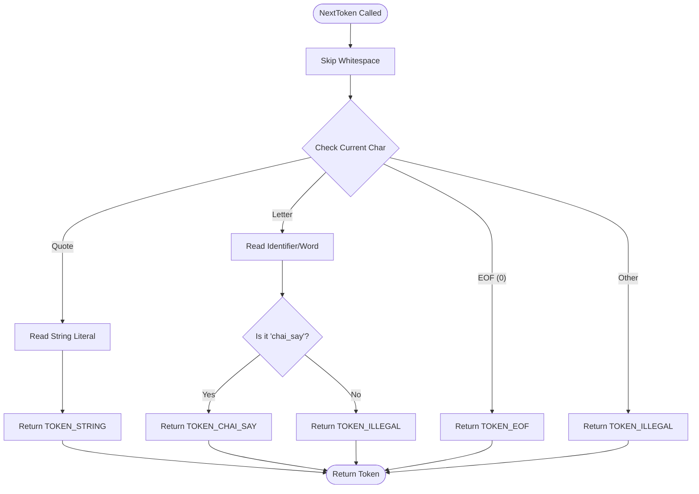
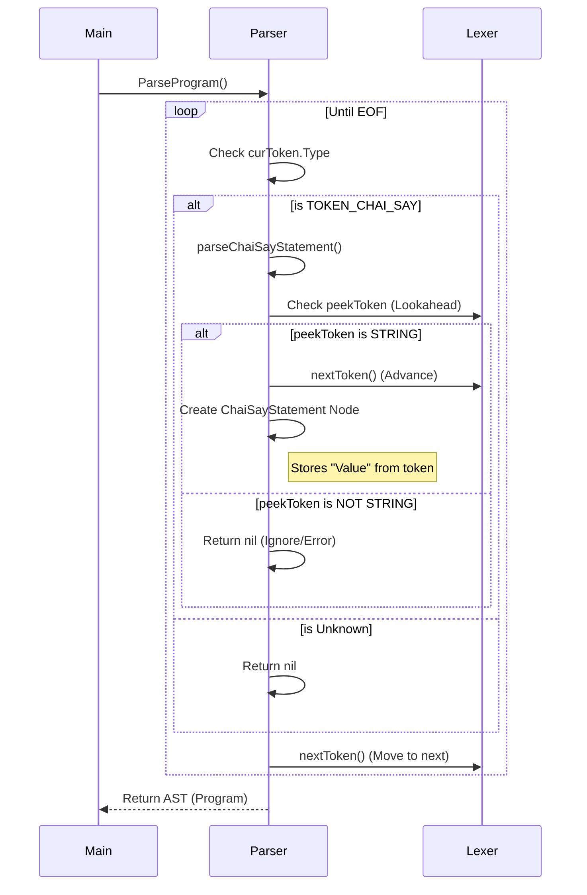
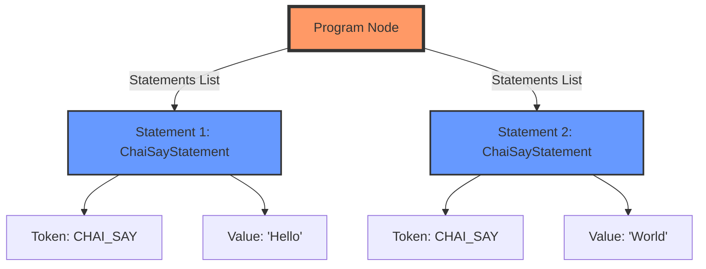

# Visualizing the Compiler (Mermaid Diagrams)

This document uses Mermaid diagrams to visualize how the different parts of the compiler interact and work internally.

## 1. High-Level Architecture

This diagram shows the data flow from your source code file to the final output.

```mermaid
flowchart LR
    Source["Source Code (.chi)"] -->|Input| Lexer
    Lexer -->|Generates| Tokens
    Tokens -->|Input| Parser
    Parser -->|Builds| AST[Abstract Syntax Tree]
    AST -->|Input| Evaluator
    Evaluator -->|Executes| Output[Terminal Output]

    style Source fill:#f9f,stroke:#333,stroke-width:2px
    style AST fill:#bbf,stroke:#333,stroke-width:2px
    style Output fill:#bfb,stroke:#333,stroke-width:2px
```



---

## 2. The Lexer Process (`NextToken`)

How the Lexer decides what token to create when it reads a character.



---

## 3. The Parser Interaction

How the Parser talks to the Lexer to build the AST.



---

## 4. AST Visualization

What the data structure looks like for a simple program.

**Code:**

```plaintext
chai_say "Hello"
chai_say "World"
```

**Tree Structure:**


